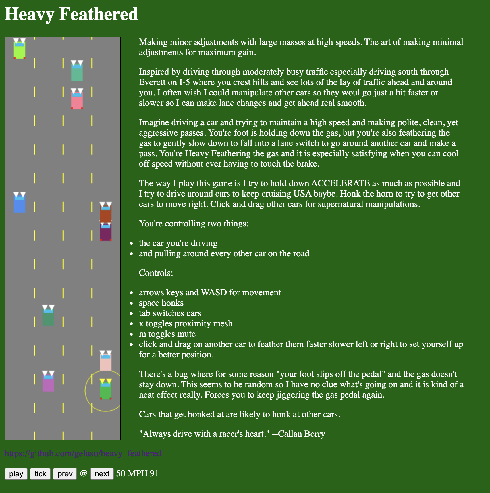

# Heavy Feathered
https://5tephen.com/heavy_feathered/

Making minor adjustments with large masses at high speeds.
The art of making minimal adjustments for maximum gain.

Inspired by driving through moderately busy traffic especially
driving south through Everett on I-5 where you crest hills and
see lots of the lay of traffic ahead and around you. I often wish
I could manipulate other cars so they woul go just a bit faster
or slower so I can make lane changes and get ahead real smooth.

Imagine driving a car and trying to maintain a high speed and making
polite, clean, yet aggressive passes. You're foot is holding down the
gas, but you're also feathering the gas to gently slow down to fall into
a lane switch to go around another car and make a pass. You're Heavy
Feathering the gas and it is especially satisfying when you can cool off
speed without ever having to touch the brake.

The way I play this game is I try to hold down ACCELERATE as much as
possible and I try to drive around cars to keep cruising USA baybe.
Honk the horn to try to get other cars to move right. Click and drag
other cars for supernatural manipulations.

You're controlling two things:
* the car you're driving
* and pulling around every other car on the road

Controls:
* arrows keys and WASD for movement</li>
* space honks</li>
* tab switches cars</li>
* x toggles proximity mesh</li>
* m toggles mute</li>
* click and drag on another car to feather them faster slower left or
  right to set yourself up for a better position.

There's a bug where for some reason "your foot slips off the pedal" and
the gas doesn't stay down. This seems to be random so I have no clue what's
going on and it is kind of a neat effect really. Forces you to keep jiggering
the gas pedal again.

Cars that get honked at are likely to honk at other cars.

"Always drive with a racer's heart." --Callan Berry
